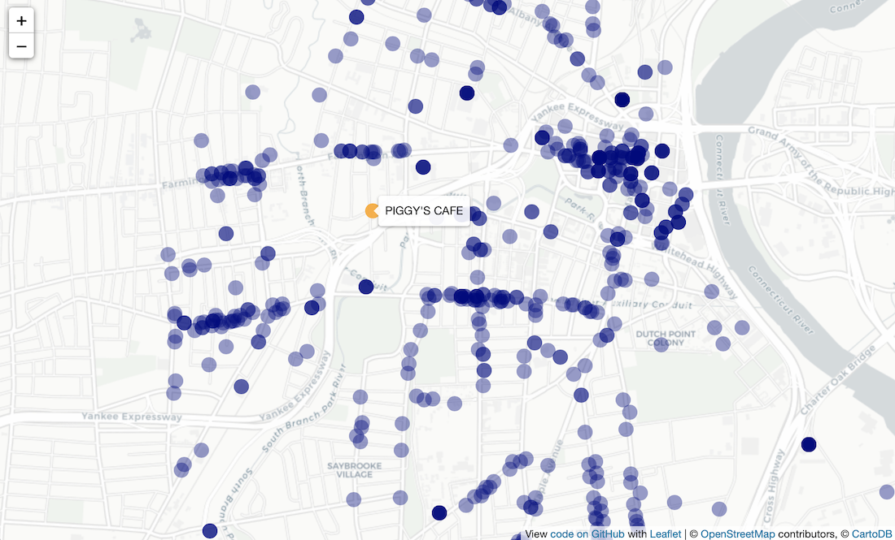
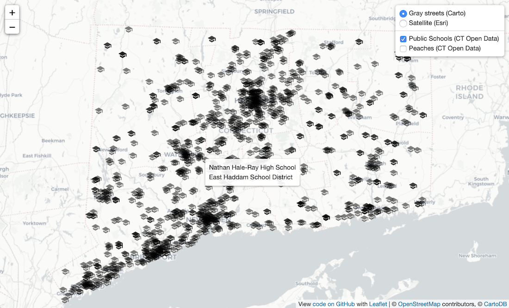
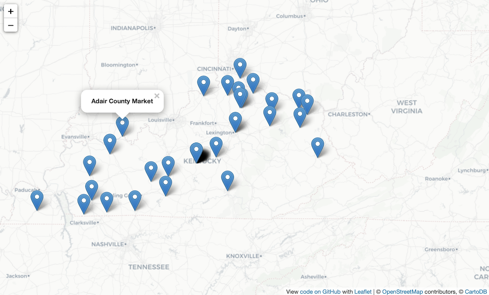

# leaflet-socrata
Leaflet maps with Socrata API open data feeds, in GeoJSON and JSON format. To learn why and how to pair Leaflet with Socrata, see free online book, *Hands-On Data Visualization*, https://HandsOnDataViz.org.

> Requires developers to register for a free Socrata app token at https://dev.socrata.com/register.

## Demonstration maps

### GeoJSON endpoint with circle markers and tooltip info window

- Map: https://handsondataviz.github.io/leaflet-socrata/index.html
- Data: https://data.hartford.gov/Public-Health/Current-Class-1-Class-4-Food-Establishments/xkvv-76v8

### GeoJSON endpoint with simple data filter, default marker styling and pop-up info

- Map: https://handsondataviz.github.io/leaflet-socrata/index-geojson-filter.html
- Data: https://data.ct.gov/Environment-and-Natural-Resources/Agricultural-Commoditites-Grown-By-Farmer/y6p2-px98

### Multiple Socrata datasets with Leaflet control layers legend

- Map: https://handsondataviz.github.io/leaflet-socrata/index-control-layers.html
- Data: Connecticut School Directory (https://data.ct.gov/resource/v4tt-nt9n) and Agricultural Commodities Grown by Farmer (https://data.ct.gov/resource/y6p2-px98)

### Older JSON-only endpoint, with separate columns for latitude, longitude

- Map: https://handsondataviz.github.io/leaflet-socrata/index-json.html
- Data: https://opendata.demo.socrata.com/Government/Kentucky-Farmers-Market-Map/3bfj-rqn7

## Learn more
- https://dev.socrata.com/
- https://dev.socrata.com/consumers/getting-started.html
- https://github.com/chriswhong/simpleSodaLeaflet

## Thanks to
- Chris Metcalf https://github.com/chrismetcalf
- Tyler Klyeklamp https://data.ct.gov/
